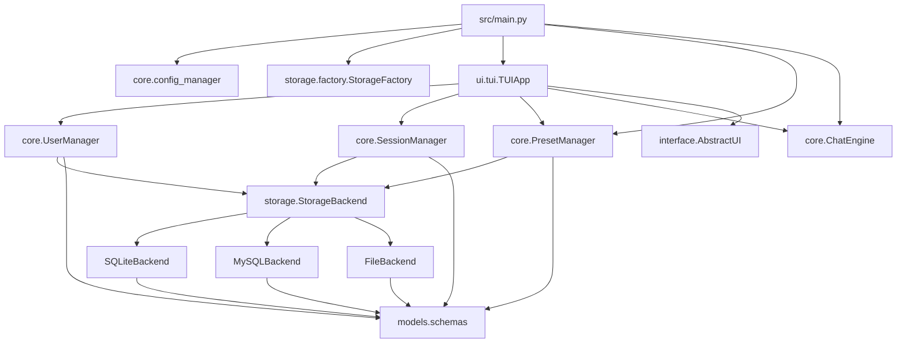
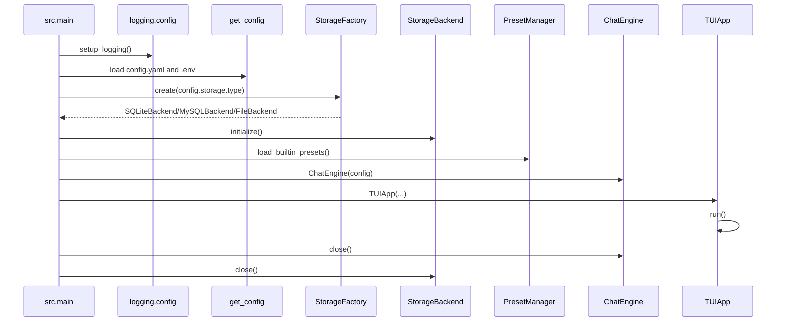
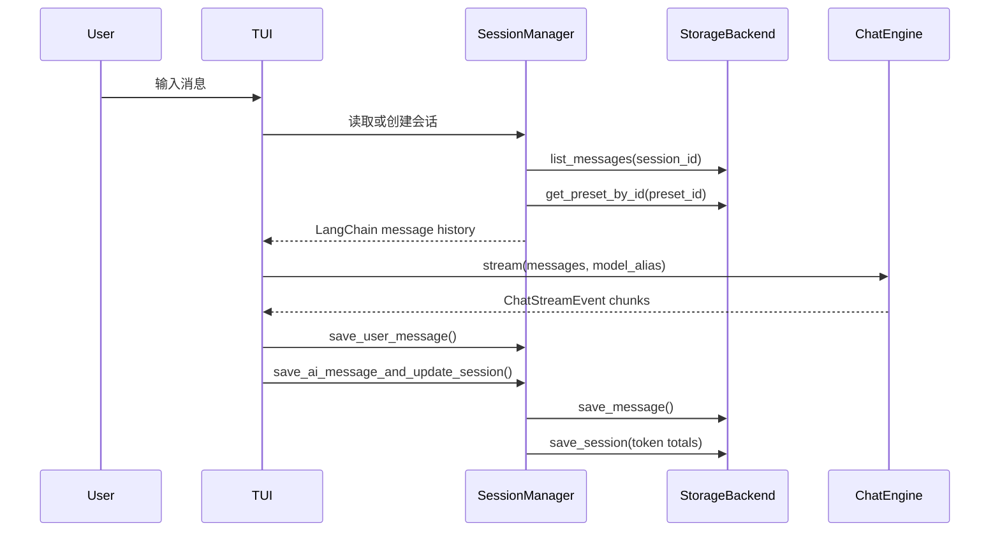
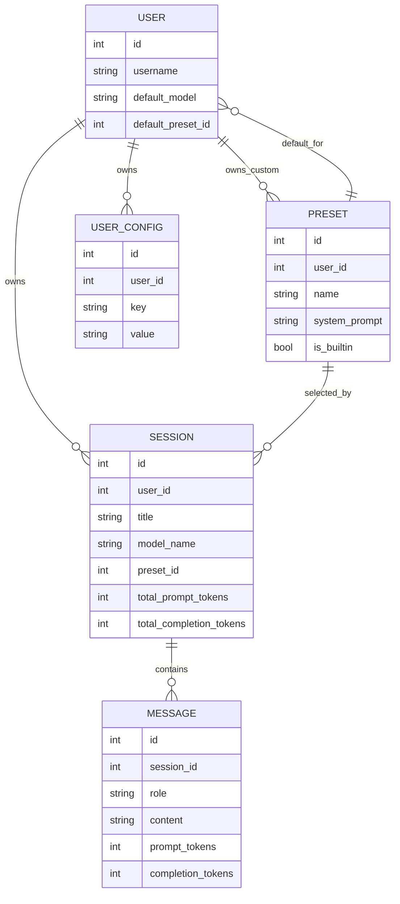
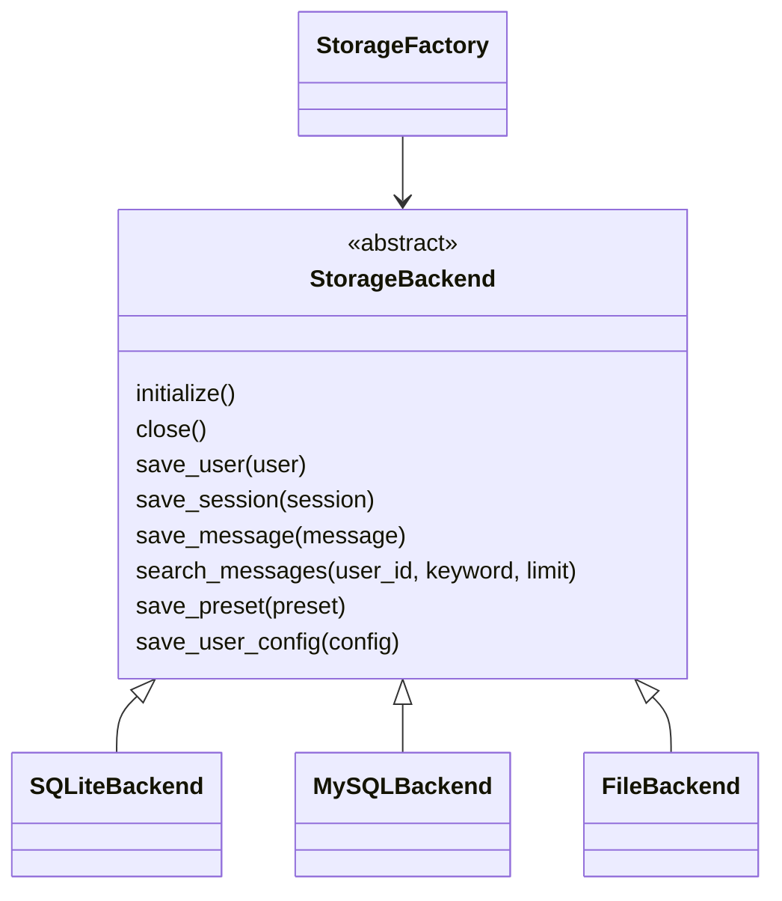

# Architecture

本文档描述 `langchain-chat` 在 Step 14 的真实实现。后续能力会继续演进，但本文不会把尚未实现的 WebUI、多模型并行对比、图文、语音或 Tool Calling 写成已完成能力。

## 目标和范围

`langchain-chat` 是一个基于 LangChain 的多用户、多会话 TUI Chatbot。当前范围包括配置加载、三种存储后端、用户和预设管理、会话管理、异步流式模型调用、Markdown 导出、结构化日志和核心模块测试。

Step 14 的新增范围是文档和接口预留：完善 README、补充架构文档，并在 `src/interface/ui_protocol.py` 定义未来 UI 能力的可选协议。

## 分层架构



### 层职责

- `src/models`：Pydantic 数据模型，包括 `User`、`Session`、`Message`、`Preset`、`UserConfig`。
- `src/storage`：`StorageBackend` 抽象接口，以及 SQLite、MySQL、File 三个实现。
- `src/core`：配置、用户、预设、会话和 ChatEngine 业务逻辑。
- `src/interface`：UI 基础协议和 Step 14 未来能力接口预留。
- `src/ui/tui`：当前 Rich / prompt-toolkit TUI 实现。
- `config`：业务配置、日志配置和系统内置预设。

### 依赖方向

UI 可以依赖 core。core 依赖 `StorageBackend` 抽象，而不依赖具体 UI。业务层不直接写 SQL，SQL 只存在于具体存储后端。`StorageFactory` 是选择具体后端的唯一入口。

## 启动流程



启动顺序要求日志先于业务初始化完成。`setup_logging()` 创建 `logs/`，加载 `config/logging.yaml`，并通过 `dictConfig` 注册控制台 handler 和 JSONL 文件 handler。

## 一轮对话流程



`SessionManager.load_langchain_messages()` 会按顺序加载历史消息，并在需要时把预设的 system prompt 放到上下文开头。`ChatEngine` 本身无状态，不保存用户、会话或消息。

## 实体关系



系统内置预设使用 `user_id=None` 和 `is_builtin=True`。用户自定义预设只对所属用户可见。

## 存储后端



- SQLiteBackend：使用 `aiosqlite`，默认路径 `data/sqlite/app.db`。
- MySQLBackend：使用 `aiomysql` 连接池，连接信息从 `.env` 中的 MySQL 环境变量解析。
- FileBackend：使用 `users.json`、`sessions.json`、`messages.json`、`presets.json`、`user_configs.json` 五个 JSON 文件。

SQLite 和 MySQL 依赖数据库约束完成部分级联行为。FileBackend 手动维护用户、会话、消息、预设和配置的级联删除。

扩展新存储后端时，应实现 `StorageBackend` 的全部抽象方法，再在 `StorageFactory.create()` 中增加新的类型分支。业务层不应直接实例化具体后端。

## 配置和敏感信息边界

`config.yaml` 保存业务配置和环境变量名，不保存真实密钥。`.env` 保存本地敏感值，不提交到 Git。`AppConfig.get_model_config()` 根据模型注册表和环境变量解析运行时模型配置。`storage.type` 控制后端选择。

Step 15 计划实现基础配置和环境覆盖配置，例如 `config.yaml + config.{APP_ENV}.yaml`。Step 14 尚未实现该能力。

## 日志系统

`src/main.py` 在业务组件初始化之前调用 `setup_logging()`。日志配置来自 `config/logging.yaml`：

- 控制台 handler：面向开发者阅读，默认 WARNING。
- 文件 handler：`TimedRotatingFileHandler`，输出 `logs/app.log`。
- JSONL formatter：`core.logging_utils.JsonLineFormatter`，每行一个 JSON 对象。

日志可包含 `user_id`、`session_id`、`model`、`status`、`error_type` 等上下文。默认不记录真实 API Key、Authorization、数据库密码、完整 Prompt、模型回复或 system prompt。

## 错误处理边界

配置错误由 `ConfigError` 表示。业务层通常把用户输入或权限问题转为 `ValueError`，TUI 展示可理解消息。需要技术栈信息时用日志记录。UI 不应把内部堆栈作为普通文本展示给用户。

## 测试结构和 Mock 边界

测试位于 `tests/`：

- `tests/conftest.py` 提供临时配置、临时 SQLite/File 后端和业务 manager fixture。
- `tests/test_storage.py` 对 SQLiteBackend 和 FileBackend 运行同一套存储契约测试。
- `tests/test_chat_engine_core.py` 在项目 `_get_model` 边界使用 fake model，不调用真实 LLM。
- `tests/test_mysql_backend.py` 是显式 MySQL 集成测试，默认 skipped。

默认测试不依赖真实 LLM、互联网或正在运行的 MySQL Server。

## 导出路径

会话导出由 `SessionManager.export_session_markdown()` 实现。导出目录来自：

```yaml
export:
  dir: data/users/{username}/exports
```

`SessionManager` 会对用户名和标题做文件名安全处理，并限制导出目录位于项目 `data/` 之下。

## 当前 TUI 和未来 WebUI

当前 UI 是 `TUIApp`，实现 `AbstractUI` 的五个基础异步方法。WebUI 不应要求 core 引入 Web 框架依赖。未来 WebUI 可以实现同一个基础 UI 协议，并按需实现 Step 14 新增的可选能力协议。

## 后期扩展接口设计

`src/interface/ui_protocol.py` 在不破坏当前 TUI 的前提下预留：

- H1 `WebUIProtocol`：WebUI 接入边界。
- H2 `MultiModelCompareRequest`、`SingleModelCompareResult`、`MultiModelComparisonUI`。
- H3 `UIAttachmentRef`、`AttachmentInputUI`。
- H4 `SpeechToTextRequest`、`SpeechToTextResult`、`TextToSpeechRequest`、`TextToSpeechResult`、`VoiceIOUI`。
- H5 `ToolCallRequest`、`ToolCallUpdate`、`ToolCallingUI`。

这些接口只描述数据契约和展示边界，不执行并行模型调用、不读取文件、不解析音频、不执行工具。

## 当前技术债务和限制

- 部分早期文件的中文内容在某些终端编码下显示为乱码，但源文件按 UTF-8 保存。
- FileBackend 适合教学和小数据，不提供多进程并发写事务保证。
- TUI 是当前唯一完整 UI。
- StorageFactory 目前只支持 `sqlite`、`mysql`、`file`。
- 日志 formatter、StorageFactory 配置错误和更多 TUI 行为仍可在后续测试中加强。

## Step 15 计划

Step 15 计划实现基础配置加环境覆盖配置，让开发、测试、生产配置分层更清晰。当前 Step 14 只保留说明和边界，不实现 `APP_ENV` 加载逻辑，也不创建 `config.dev.yaml`、`config.test.yaml` 或 `config.prod.yaml`。
