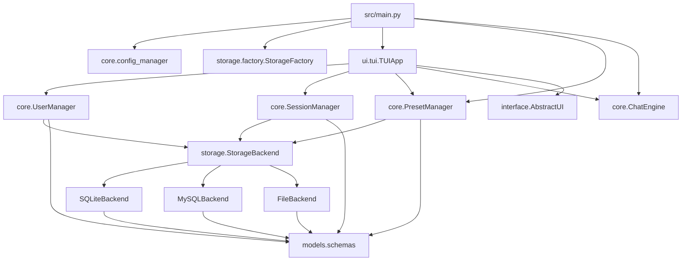
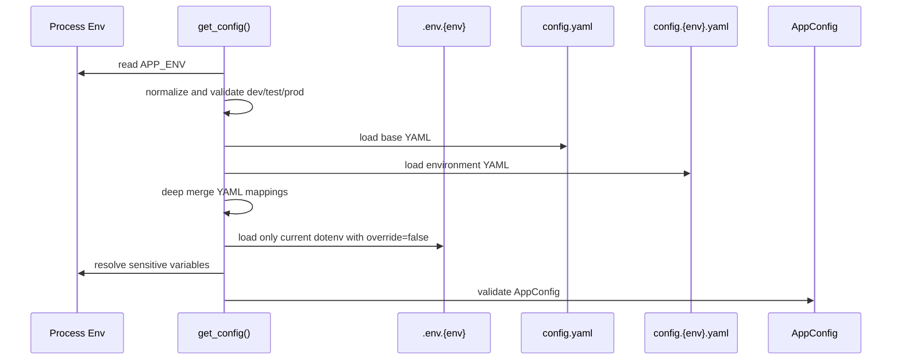
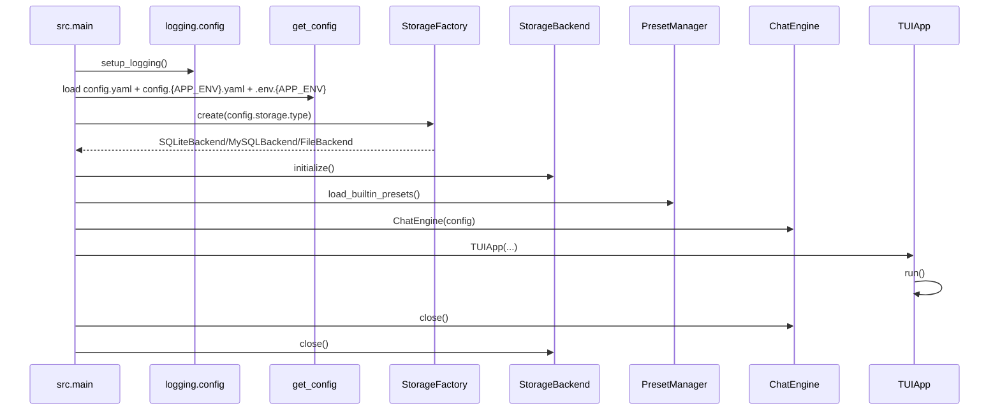
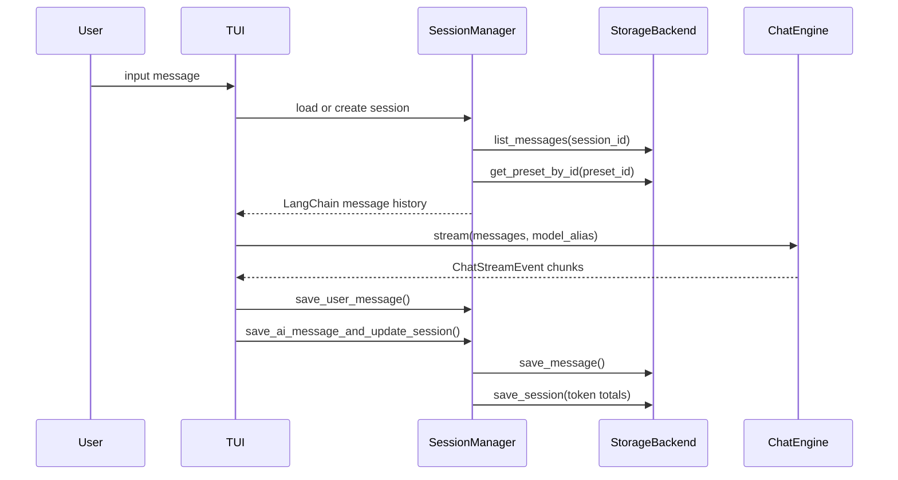
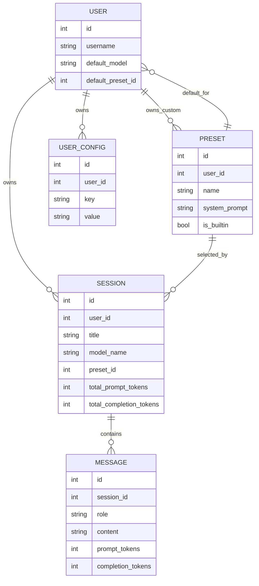
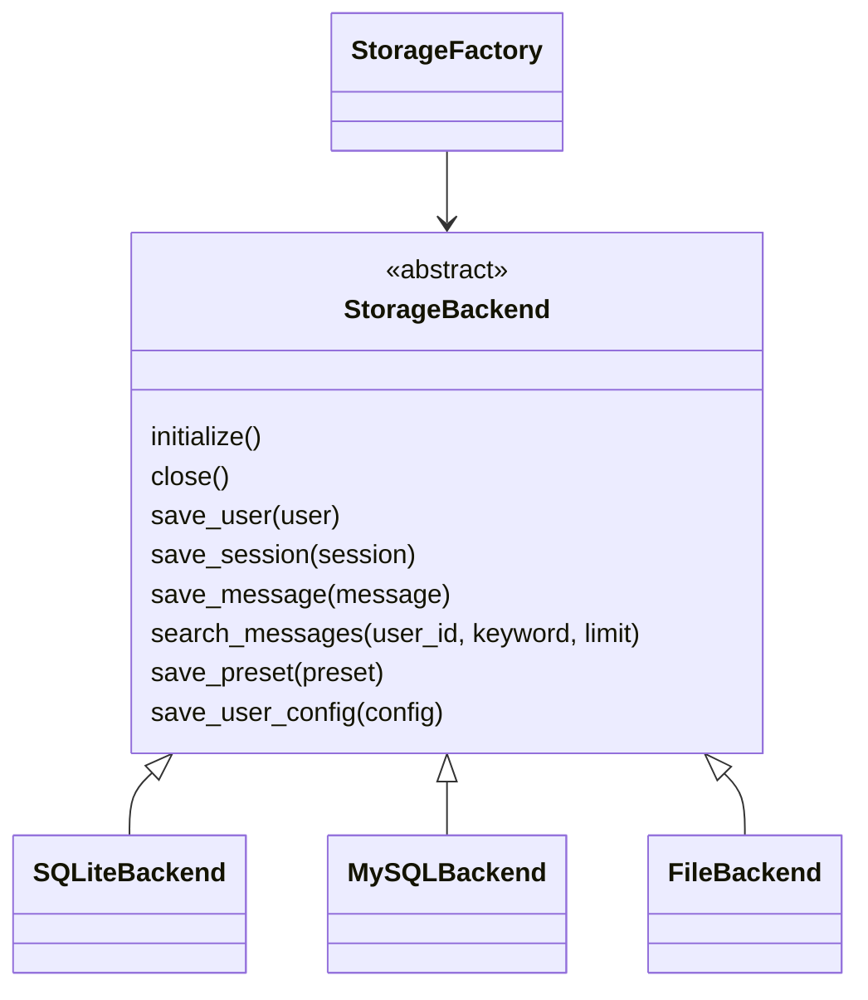

# Architecture

本文描述 `langchain-chat` 在 Step 15 的真实实现。当前已实现 TUI、三种存储后端、结构化日志、核心测试和 dev/test/prod 多环境配置隔离；WebUI、多模型并行对比、图文上传、语音和 Tool Calling 仍只是接口预留。

## 目标和范围

`langchain-chat` 是一个基于 LangChain 的多用户、多会话 TUI Chatbot。当前范围包括配置加载、三种存储后端、用户和预设管理、会话管理、异步流式模型调用、Markdown 导出、结构化日志、核心模块测试，以及 Step 15 的多环境配置隔离。

Step 15 落实 REQ-001：用 `APP_ENV` 切换 dev/test/prod，使业务配置、敏感信息和数据源互相隔离。

## 分层架构



- `src/models`：Pydantic 数据模型，包括 `User`、`Session`、`Message`、`Preset`、`UserConfig`。
- `src/storage`：`StorageBackend` 抽象接口，以及 SQLite、MySQL、File 三个实现。
- `src/core`：配置、用户、预设、会话和 ChatEngine 业务逻辑。
- `src/interface`：基础 UI 协议和后期能力的可选 Protocol。
- `src/ui/tui`：当前 Rich / prompt-toolkit TUI 实现。
- `config`：日志配置和系统内置预设；业务基础配置位于仓库根目录的 YAML 文件。

## 依赖方向

UI 可以依赖 core；core 依赖 `StorageBackend` 抽象而不是具体存储；core 不依赖具体 TUI 或 Web 框架；core 不直接写 SQL。SQL 只存在于 SQLite/MySQL 存储后端。`StorageFactory` 是选择具体后端的入口，业务层不直接实例化具体后端。

## 配置加载流程



### APP_ENV 决策点

- 进程环境变量 `APP_ENV` 是唯一环境选择入口。
- 未设置时默认为 `dev`。
- 会去除首尾空格并转为小写。
- 只允许 `dev`、`test`、`prod`。
- 非法值立即抛出 `ConfigError`，不会回退。
- 最终环境可通过 `config.app_env` 和 `config.app.env` 读取。

### YAML 深度覆盖规则

最终配置 = `config.yaml` + `config.{APP_ENV}.yaml`。

- mapping/dict：递归合并。
- scalar：环境配置覆盖基础配置。
- list：环境配置整体替换基础列表。
- 环境文件可以新增基础配置中没有的键。
- 合并函数不修改原始基础配置对象。
- 缺失 YAML、非法 YAML 或顶层不是 mapping 时抛出 `ConfigError`。

### dotenv 选择和优先级

- `APP_ENV=dev` 只加载 `.env.dev`。
- `APP_ENV=test` 只加载 `.env.test`。
- `APP_ENV=prod` 只加载 `.env.prod`。
- Step 15 后不默认加载旧 `.env`。
- `load_dotenv(..., override=False)` 保证操作系统或 PowerShell 已设置的变量优先于 dotenv。
- dotenv 缺失不会自动读取其他环境文件；真正需要密钥或数据库密码时由模型配置或 MySQL 配置校验失败。
- 不打印 dotenv 内容，不在异常中包含密钥值。

## 启动流程



日志必须先于业务组件初始化完成。`setup_logging()` 创建 `logs/`，加载 `config/logging.yaml`，并通过 `dictConfig` 注册控制台 handler 和 JSONL 文件 handler。启动日志可记录当前环境、配置文件名和存储类型，但不得记录密钥、密码或完整连接串。

## 对话主流程



`SessionManager.load_langchain_messages()` 按顺序加载历史消息，并在需要时把预设的 system prompt 放到上下文开头。`ChatEngine` 不保存用户、会话或消息状态；状态由 storage 和 manager 维护。

## 实体关系



系统内置预设使用 `user_id=None` 和 `is_builtin=True`，对所有用户可见。用户自定义预设只对所属用户可见。

## 存储后端



- SQLiteBackend：使用 `aiosqlite`，dev 默认路径为 `data/dev/sqlite/app.db`，test 默认路径为 `data/test/sqlite/app.db`。
- MySQLBackend：使用 `aiomysql` 连接池，prod 通过 `PROD_MYSQL_*` 解析连接信息。
- FileBackend：使用 `users.json`、`sessions.json`、`messages.json`、`presets.json`、`user_configs.json` 五个 JSON 文件。

SQLite 和 MySQL 依赖数据库约束完成部分级联行为；FileBackend 手动维护用户、会话、消息、预设和配置的级联删除。

扩展新存储后端时，应实现 `StorageBackend` 的全部抽象方法，再在 `StorageFactory.create()` 增加新分支。业务层不应增加存储类型判断。

## 数据源和密钥隔离

- dev：`config.dev.yaml` + `.env.dev` + `data/dev/...`。
- test：`config.test.yaml` + `.env.test` + `data/test/...`；自动测试使用临时目录优先，不写正式数据目录。
- prod：`config.prod.yaml` + `.env.prod` + MySQL；缺少生产模型或 MySQL 配置时失败。

prod 不回退到 dev 的安全原则：生产环境的模型变量使用 `PROD_*`，MySQL 变量使用 `PROD_MYSQL_*`。配置解析不会把 `DEV_*` 或旧 `.env` 当作生产兜底。

## 日志系统

`src/main.py` 在业务组件初始化前调用 `setup_logging()`。日志配置来自 `config/logging.yaml`：

- 控制台 handler：面向开发者阅读，默认 WARNING。
- 文件 handler：`TimedRotatingFileHandler`，输出 `logs/app.log`。
- JSONL formatter：`core.logging_utils.JsonLineFormatter`，每行一个 JSON 对象。

日志可包含 `user_id`、`session_id`、`model`、`status`、`error_type`、`app_env` 等上下文。默认不记录真实 API Key、Authorization、数据库密码、完整连接串、完整 Prompt、模型回复或 system prompt。

## 错误处理边界

配置错误用 `ConfigError` 表示。业务层通常把用户输入或权限问题转为 `ValueError`，UI 展示可理解文本；技术上下文由日志记录。UI 不应把内部堆栈作为普通文本展示给用户。

## 测试结构和 Mock 边界

测试位于 `tests/`：

- `tests/conftest.py` 提供临时配置、临时 SQLite/File 后端和业务 manager fixture。
- `tests/test_storage.py` 对 SQLiteBackend 和 FileBackend 运行同一套存储契约测试。
- `tests/test_chat_engine_core.py` 在项目 `_get_model` 边界使用 fake model，不调用真实 LLM。
- `tests/test_config_manager.py` 使用临时 YAML 和临时 `.env.{env}` 验证 Step 15 配置隔离。
- `tests/test_mysql_backend.py` 是显式 MySQL 集成测试，默认 skipped。

默认测试不依赖真实 LLM、互联网或正在运行的 MySQL Server。同一进程切换 `APP_ENV` 的测试会调用 `reset_config_cache()` 清理配置缓存。

## 导出路径

会话导出由 `SessionManager.export_session_markdown()` 实现。导出目录来自最终配置：

```yaml
export:
  dir: data/dev/users/{username}/exports
```

环境不同，导出路径不同。`SessionManager` 会对用户名和标题做文件名安全处理，并限制导出目录位于项目 `data/` 之下。

## 当前 TUI 和未来 WebUI

当前 UI 是 `TUIApp`，实现 `AbstractUI` 的基础异步方法。WebUI 不应要求 core 引入 Web 框架依赖。未来 WebUI 可以实现同一基础 UI 协议，并按需实现 Step 14 新增的可选能力协议。

## 后期扩展接口设计

`src/interface/ui_protocol.py` 在不破坏当前 TUI 的前提下预留：

- H1 `WebUIProtocol`：WebUI 接入边界。
- H2 `MultiModelCompareRequest`、`SingleModelCompareResult`、`MultiModelComparisonUI`。
- H3 `UIAttachmentRef`、`AttachmentInputUI`。
- H4 `SpeechToTextRequest`、`SpeechToTextResult`、`TextToSpeechRequest`、`TextToSpeechResult`、`VoiceIOUI`。
- H5 `ToolCallRequest`、`ToolCallUpdate`、`ToolCallingUI`。

这些接口只描述数据契约和展示边界，不执行并行模型调用、不读取文件、不解析音频、不执行工具。

## 当前技术债务和限制

- FileBackend 适合教学和小数据，不提供多进程并发写事务保证。
- TUI 是当前唯一完整 UI。
- 默认自动化测试不验证真实 LLM 或真实 MySQL 服务。
- prod 的真实冒烟需要用户提供 MySQL 和模型环境后手工验证。
- Step 15 已实现配置隔离，但真实生产数据库与模型调用不能由自动测试伪造。
